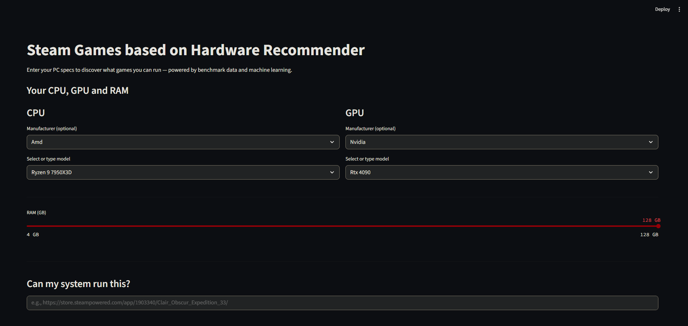

# Steam Games based on Hardware Recommender

[](https://steamgameshardwarerec.streamlit.app)  
*A machine learning-powered tool to recommend Steam games based on your PC hardware.*



## Problem & Motivation

In early 2026, PC gamers face several challenges:
- **Hardware Pricing Crisis**: GPUs, CPUs, and RAM have become prohibitively expensive due to commercial supply outranking consumers, making PC upgrades and gaming difficult.
- **Lack of Hardware-Based Game Recommendations**: Most tools suggest games by genre or popularity, ignoring whether your actual PC can run them smoothly.
- **Inconsistent & Messy Data**: Steam system requirements are often vague, outdated, missing, or poorly formatted. Benchmark data is scattered across sites.

This project solves these by building a **personalized "Can I Run It?" recommender** using:
- Real 2026 Tom's Hardware CPU/GPU benchmarks
- Enriched Steam dataset (50,000 games)
- Fuzzy matching + rule-based imputation for unmatched hardware
- Synthetic data + Random Forest ML for accurate compatibility prediction

It demonstrates end-to-end handling of **real-world messy data**, **imputation**, **fuzzy string matching**, and **machine learning** to deliver practical, hardware-aware game recommendations.

## Features

- Enter your CPU, GPU, and RAM and get 0–100 component performance scores
- Paste any Steam game URL, return "Yes/No" prediction with the model confidence %
- View minimum & recommended specs side-by-side (if available in data)
- Listing of the Top 20 most popular games you can actually run
- Catalog highlights: Top 10 most & least demanding games
- Fully reproducible pipeline (no large files in repo)

## Live Demo

Try it now — no installation needed!  
**https://steamgameshardwarerec.streamlit.app**  


## Quick Start

### Option 1: Virtual Environment (Recommended)

```bash
git clone https://github.com/Tgill1085/MLZoomCamp2025.git
cd MLZoomCamp2025/steamhardwarerec

# Create and activate virtual environment
python -m venv venv
source venv/bin/activate    # On Windows: venv\Scripts\activate

# Install dependencies
pip install -r requirements.txt

# Generate data & train model (first time only)
python train.py

# Launch the app
streamlit run predict.py
```
Open http://localhost:8501 in your browser.


### Option 2: Docker
```bash
git clone https://github.com/Tgill1085/MLZoomCamp2025.git
cd MLZoomCamp2025/steamhardwarerec

# Build and run
docker build -t steam-recommender .
docker run -p 8501:8501 steam-recommender
```
Open http://localhost:8501
Note: The first run (inside Docker) will automatically train the model if missing.

### Option 3: Just Use the Web App
No setup needed!
Go directly to: https://steamgameshardwarerec.streamlit.app

``` text
.
├── data_gathering.ipynb          # Scrapes benchmarks + processes Steam data
├── notebook.ipynb                # Feature engineering, modeling, analysis
├── train.py                      # Standalone: trains and saves model
├── predict.py                    # Streamlit web app
├── requirements.txt              # Dependencies
├── Dockerfile                    # Containerized deployment
├── steam_games_final.csv         # Generated enriched data (created on run)
└── can_run_model_final.pkl       # Trained model (generated on first run)
```

## How It Works

1. **Data Gathering**  
   Auto-downloads the Steam dataset from Zenodo and scrapes 2026 CPU/GPU benchmarks from Tom's Hardware.

2. **Enrichment**  
   Uses fuzzy matching (RapidFuzz) + hand-crafted rules to handle unmatched and low-end GPUs/CPUs for maximum coverage.

3. **Intensity Scoring**  
   Computes a weighted demand score for each game:  
   **70% GPU** + **20% CPU** + **10% RAM**  
   (Higher = more demanding)

4. **Synthetic Training**  
   Generates 100,000 balanced user-game pairs to train the model on realistic "can run / cannot run" scenarios.

5. **Random Forest Model**  
   Predicts compatibility probability using hardware deltas (user vs game requirements).

6. **Streamlit App**  
   Interactive web UI for entering hardware, checking any Steam game, and getting personalized recommendations.

## Notes for Reproducibility

- Large files (the trained model `.pkl`) are **not committed** to the repo due to size limits.
- They are **generated automatically** on first run.
- `train.py` checks for required data and trains a fresh model if needed.
- All scraping and downloading steps are fully automated — no manual file uploads required.

## Built With

- **Python** / **Pandas** / **Scikit-learn** – Core data processing and modeling
- **RapidFuzz** – High-performance fuzzy string matching
- **Streamlit** – Interactive web app
- **Docker** – Containerized deployment option


